# Sobre o projeto:
Esse projeto foi criado e colocado em produção para realizar o controle de estoque e de vendas de uma loja. Ele tem como intuito facilitar na verificação de lucros e de recebimento de pagamentos dos clientes que possuem alguma pendencia. Fiz esse projeto para  a loja Brechó do Cruzeiro que me permitiu compartilhar o código fonte da aplicação para que outros desenvolvedores possam se espelhar e melhorá-lo.


# Imagens do projeto:
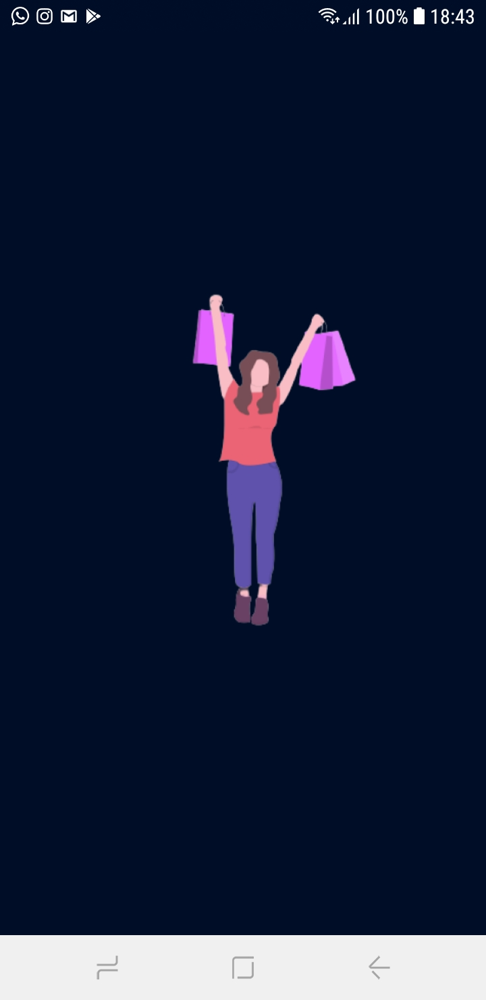

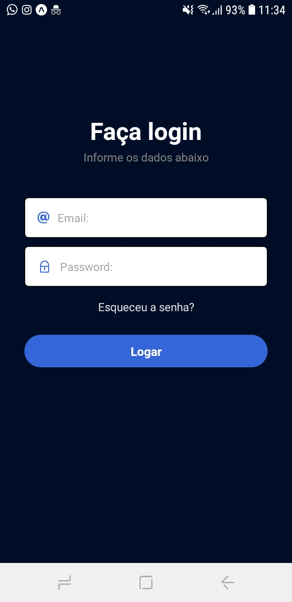

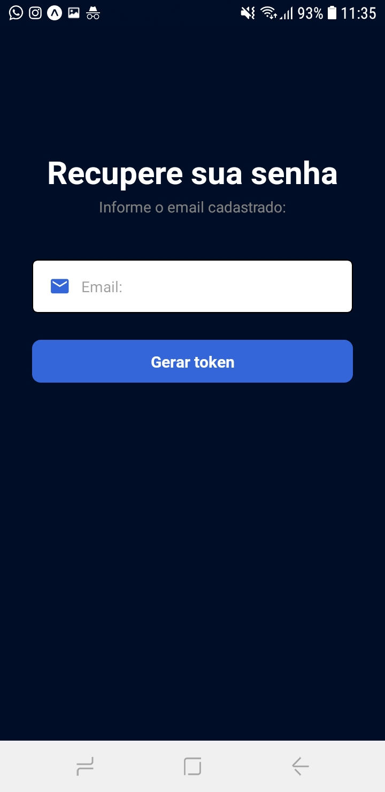

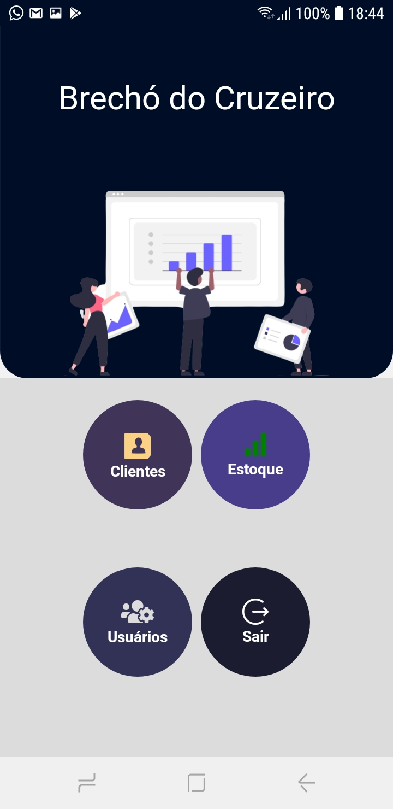

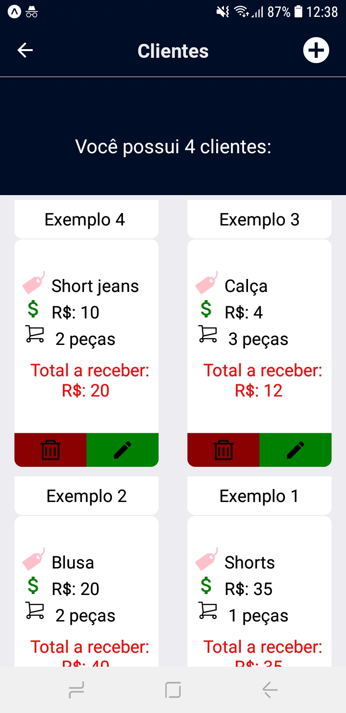

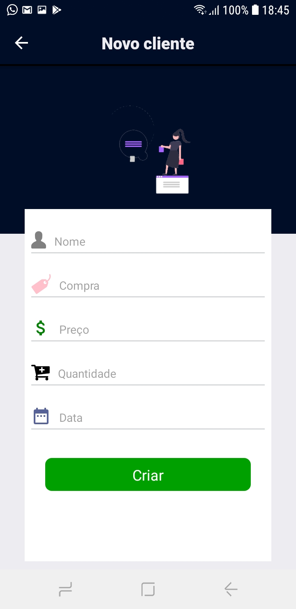

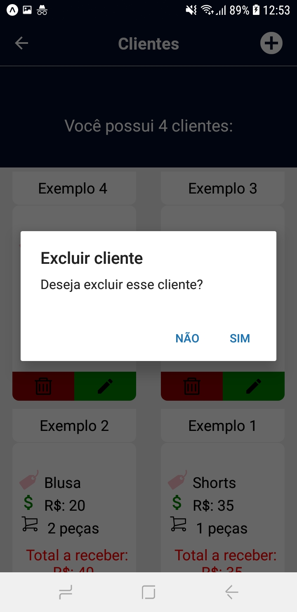

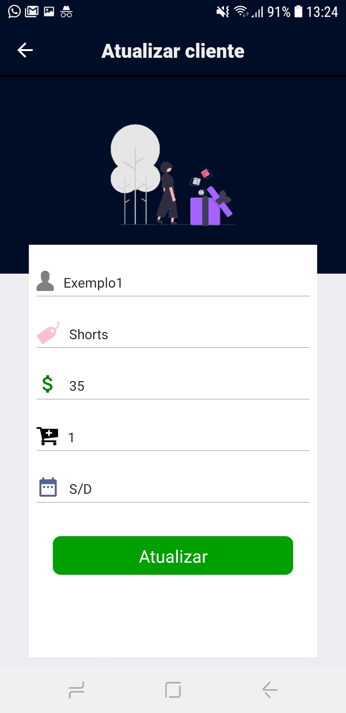

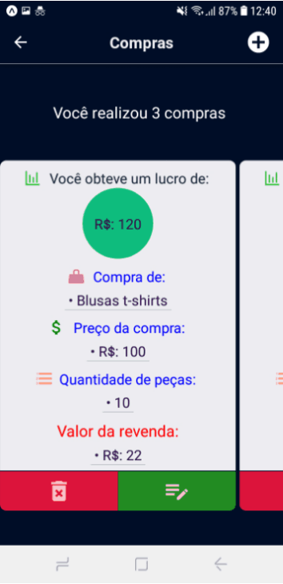

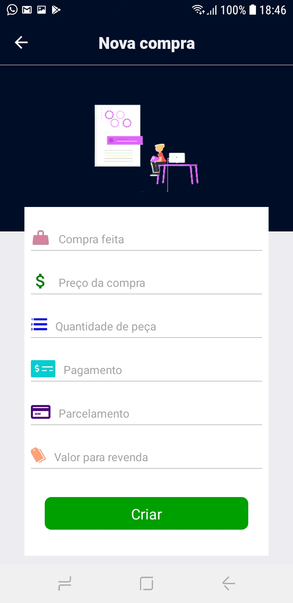

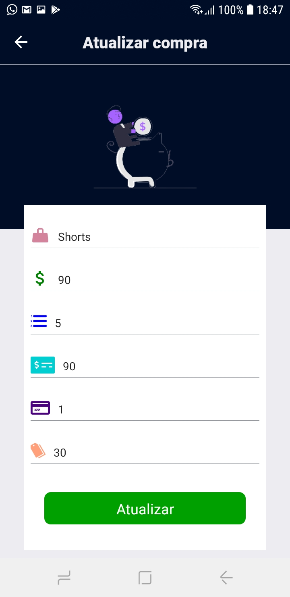

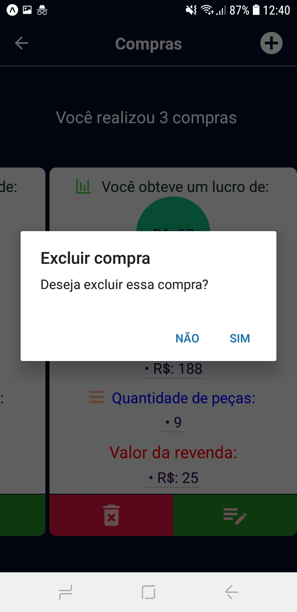

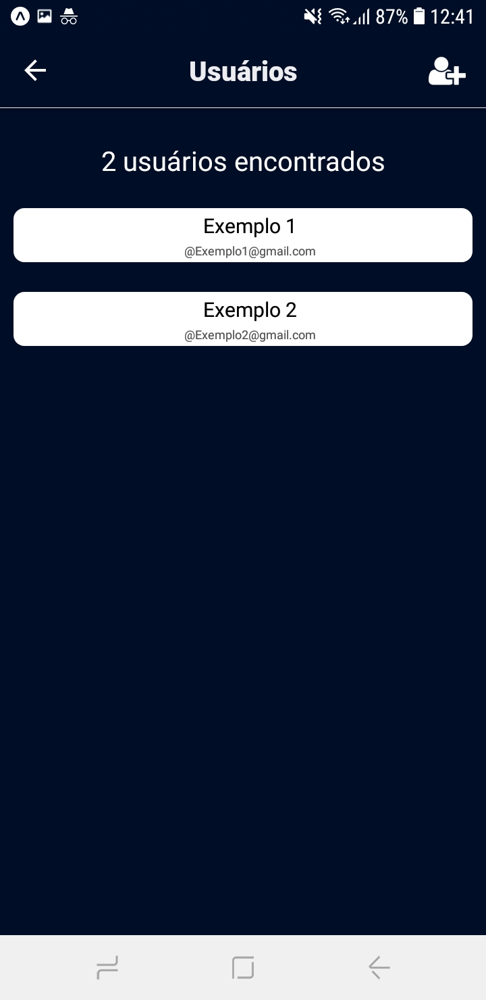

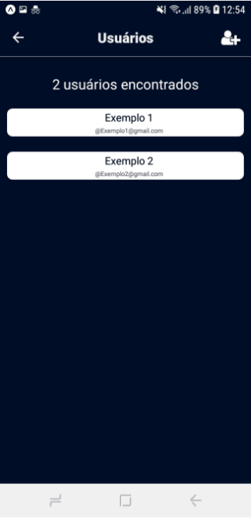

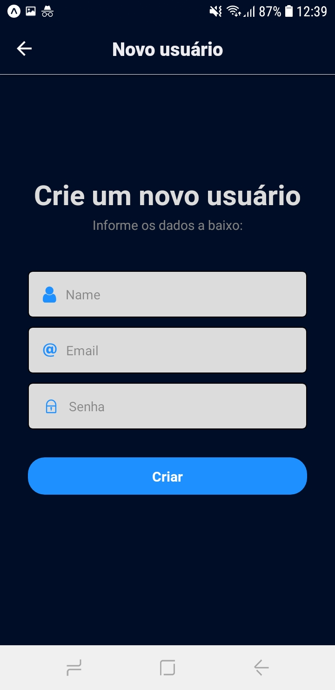


# Packages:
---

```
yarn add @react-navigation/native our npm install @react-navigation/native

expo install react-native-gesture-handler react-native-reanimated react-native-screens react-native-safe-area-context @react-native-community/masked-view

expo install @react-navigation/stack

expo install styled-components

yarn add axios our npm install axios

yarn add @react-native-async-storage/async-storage our npm install @react-native-async-storage/async-storage

expo install @expo/vector-icons

```

# Passos a seguir:

- [x] Estruturar as páginas;

- [x] Fazer as pastas de rotas para a navegação entre arquivos;

- [x] Separar as rotas em: SignIn e Main, as quais, respectivamente, estão relacionadas a quando o usuário ainda não está logado e quando já está autenticado;

- [x] Conectar o app a api;

- [x] Fazer o context para armazenar os dados de autenticação;

- [x] Fazer os arquivos de login e recuperação de senha na pasta login já conectados a api;

- [x] Pegar o token gerado pelo o usuário na autenticação e passá-lo para o context;

- [x] Tratar erros dos arquivos de login e recuperação de senha;

- [x] Fazer o arquivo de home com os buttons de navegação para outros arquivos, os quais serão os principais.

- [x] Fazer o arquivo de cliente, o qual permite ao usuário administrador ver quantos clientes ele têm. Ademais, permite que o mesmo o atualize, delete ou crie um novo. Ele mostrará o nome do cliente que está com pendencias de pagamento, qual a compra ele fez e quanto o usuário administrador receberá.  <br />

<h3 align = "center">  OBS: </h3> <br/>

 **Isso para usuários que são administradores. Usuários comuns não possuem esse previlégio.**

 - [x] Fazer o arquivo de estoque, o qual permite a usuários administradores criar, atualizar e deletar compras de sua loja. Nele é mostrado o lucro que obterá com essas compras, além de outras informações, tais como: Quantidade de peças, preço para revenda, parcelamento, entre outros.

- [x] Fazer o arquivo de controle de usuários, o qual o perfil administrador ter acesso a esses usuários, podendo criar novos e apagar os indesejados.

- [x] Estilização com styled-components;

- [x] Incluir imagens;

- [x] App criado e pronto para por em produção;


# Api:

---

Utilize como base a api que criei: https://github.com/Rfontt/Api_App_Store

Coloquei essa api em produção e esse app a consome. Porém por questões de segurança o endpoint dessa api não será disponibilizada, mas seu código servirá de base para você seguir com o app em um banco de dados local.
